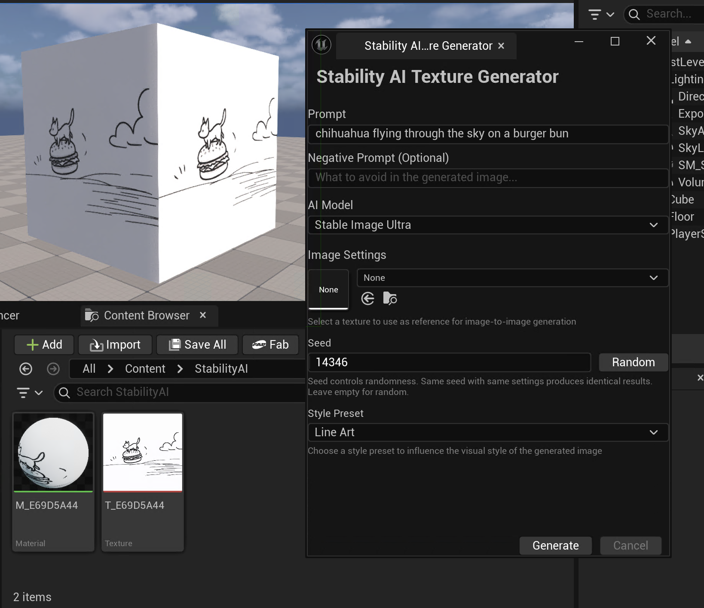
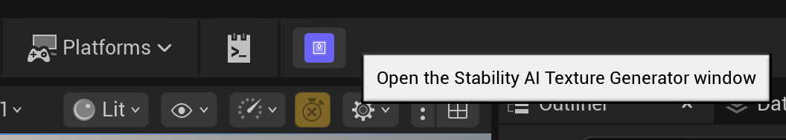

# TextureGenerator

This is a simple Unreal Engine plugin that leverages Stability AI API for generating high-quality textures directly within the editor. You can generate textures from text prompts or transform existing textures using image-to-image workflow.

## Features

- Text-to-Image and Image-to-Image support
- Support for all current Stability AI models:
  - Ultra
  - Core
  - SD3.5
- Generated images are automatically imported as UAssets, simple material gets created for quick evaluation of the texture

## Installation and setup

- Unreal 5.3+
- [Stability AI Account]([https://](https://platform.stability.ai/account)) with an active API key generated

### API key configuration

1. Generate a new API key or use existing one in your [Stability AI account]([https://](https://platform.stability.ai/account/keys))
2. In Unreal Engine, go to Edit → Project Settings
3. Navigate to Plugins → **Stability AI Image Generator**
4. Enter your API key in the API Key field

You can find the button to launch the plugin UI on the level editor toolbar.

## Usage

### Text-to-Image

The text-to-image workflow generates completely new textures from text descriptions:

1. Describe the texture you want in the main prompt field
> Example: "Weathered brick wall with moss and ivy, medieval castle style, high detail"

2. Specify what to avoid in the generation with Negative Prompt:
> Example: "blurry, low quality, modern elements, plastic"

3. Choose from available AI models based on your needs
4. Click the Generate button to start creation

# Image-to-Image

The image-to-image workflow transforms existing textures using AI guidance:
1. Choose an existing texture from your project using the texture picker
2. Describe how you want to modify the reference texture
3. Control how closely the output follows the reference texture with **Strength** parameter:

   - 0%: Ignore reference (pure text-to-image)
   - 50%: Balanced transformation
   - 1  - 100%: Closely follow reference structure

## Why Stability AI?

The platform offers open API access without geographic restrictions or complex authentication procedures. Google's Gemini service, while powerful, faces significant limitations in European markets and operates behind paywall restrictions that can complicate enterprise deployment. OpenAI's DALL-E, another prominent alternative, imposes usage limitations and typically involves higher costs for commercial applications.

Stability AI's pricing model offers exceptional value for game development workflows. The pay-per-generation structure eliminates the need for expensive subscriptions or upfront commitments.

## Limitations & Known Issues

- Each generation produces one texture
- Generated assets cannot be undone through editor history
- Only simple materials with base color are created
- Subject to Stability AI's rate limiting policies

## Future Development Ideas

### 🌋 Enhanced Material Support

One of the most significant opportunities for expansion lies in enhanced material support capabilities. The current implementation creates basic materials with only base color textures, but future versions could generate complete PBR (Physically Based Rendering) materials including normal maps, roughness maps, and metallic textures from a single prompt. This would enable artists to create fully realized surface materials without requiring multiple generation passes or manual texture creation.

### ☕️ Multi-API Integration

Developing a provider abstraction layer would allow the plugin to support multiple AI services through a unified interface, giving users flexibility in choosing their preferred generation service based on cost, quality, or availability. This system could include automatic fallback mechanisms that switch between providers when one service experiences downtime or rate limiting, ensuring uninterrupted workflow continuity.

A model comparison feature would enable side-by-side generation from different APIs, allowing artists to evaluate results from various services and select the best output for their specific needs. This comparative approach would help users understand the strengths and characteristics of different AI models while maintaining consistent workflow patterns.

### 🛠️ Workflow Improvements

Batch generation capabilities would significantly enhance productivity by allowing users to create multiple texture variations in a single operation. This feature could generate variations of the same prompt with different seeds, create texture sets for entire environments, or produce multiple iterations for A/B testing purposes. The system could also support generation queues, enabling artists to set up multiple generation tasks and return to completed results later.

### 🛟 QoL Improvements

Real-time input validation would provide immediate feedback on prompt effectiveness and parameter validity, helping users craft better prompts before initiating generation. It could be nice to store a history of submitted prompts, available in a side panel, to reference which prompts yielded better results than others.
